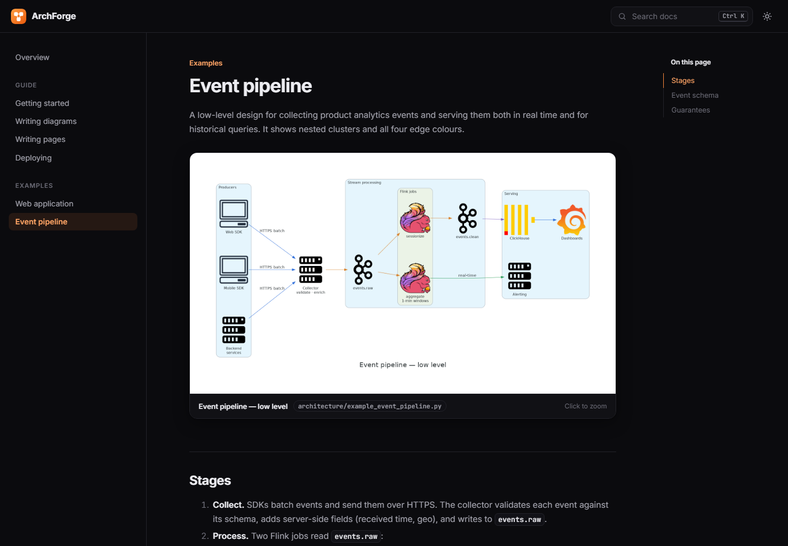

<div align="center">


# ArchForge

**Architecture diagrams as code, with docs that update as you type.**

Write diagrams in Python and pages in Markdown. Save, and your browser refreshes with the new diagram in about two seconds. Ship it as a password-protected static site on Vercel.

[Quick start](#-quick-start) · [How it works](#-how-it-works) · [Writing diagrams](#-writing-diagrams) · [Writing pages](#-writing-pages) · [Deploy](#-deploy-to-vercel)



</div>

---

## ✨ Features

- **🐍 Diagrams as code.** Uses the [`diagrams`](https://diagrams.mingrammer.com/) library, with hundreds of AWS, GCP, Azure, Kubernetes and on-prem icons. Diagrams are reviewed in PRs and diffed in git.
- **⚡ Live reload.** Save a `.py` or `.md` file and the browser updates on its own, in about 1–2 seconds.
- **🗂️ Zero config.** No YAML and no nav file. Folders become sidebar sections, and headings become page titles.
- **🐳 Nothing to install but Docker.** Graphviz and every dependency live in the container, and it falls back to Docker automatically.
- **🔍 A site people want to read.** Full-text search (<kbd>Ctrl</kbd>+<kbd>K</kbd>), click-to-zoom diagrams, dark mode, mobile layout and syntax highlighting.
- **🔒 Private by default.** Vercel Edge Middleware asks for a password before anything is served, and fails closed.
- **🪶 Tiny and hackable.** About 700 lines of Python plus a plain HTML/CSS/JS theme. No framework and no npm.

---

## 🚀 Quick start

**You need:** [Python 3.10+](https://www.python.org/downloads/) and [Docker Desktop](https://www.docker.com/products/docker-desktop/) (running).

```bash
git clone https://github.com/kunaldoliya90/archforge.git
cd archforge
python watch.py --serve
```

Open **http://localhost:8000**.

The first run builds the Docker image, which takes 1–2 minutes. Later runs start in seconds. It's ready when you see:

```text
✔ architecture/example_event_pipeline.py (0.48s)
✔ architecture/example_web_app.py (0.32s)
🌐 Serving http://localhost:8000
👀 Watching architecture/*.py, docs/, theme/ (polling). Ctrl+C to stop.
```

**Try it:** open `architecture/example_web_app.py`, change `Users("Users")` to `Users("Customers")`, and save. Watch the diagram update in your browser.

Press <kbd>Ctrl</kbd>+<kbd>C</kbd> to stop.

<details>
<summary><b>Other ways to run it</b></summary>

| You have | Run |
|---|---|
| Docker only (no Python) | `docker compose up` |
| Python + Graphviz installed locally (fastest) | `pip install -r requirements.txt` then `python watch.py --serve --local` |
| `make` (macOS / Linux / WSL) | `make setup` then `make dev` |

</details>

---

## 🧠 How it works

```text
 architecture/*.py ──(save)──▶ render PNG ──▶ docs/assets/*.png ──┐
                                                                  ├──▶ build.py ──▶ public/ ──▶ browser auto-refresh
 docs/**/*.md      ──(save)───────────────────────────────────────┘
```

| You save | What happens | Browser updates in |
|---|---|---|
| `architecture/<name>.py` | PNG re-rendered → site rebuilt → refresh | ~1–2 s |
| `docs/**/*.md` | Site rebuilt → refresh | ~1 s |
| `theme/*` | Site rebuilt → refresh | ~1 s |

If a diagram has an error, the terminal prints a red `✘` with the traceback and keeps running. Fix the file, save, and it recovers.

---

## 🎨 Writing diagrams

Each `.py` file in `architecture/` renders to a PNG with the same name in `docs/assets/`:

```python
from diagrams import Cluster, Diagram, Edge
from diagrams.onprem.database import PostgreSQL
from diagrams.programming.framework import FastAPI

from _style import DATA, DIAGRAM_DEFAULTS, output

with Diagram("Orders service", filename=output("orders"), direction="LR", **DIAGRAM_DEFAULTS):
    with Cluster("API"):
        api = FastAPI("orders-api")
    api >> Edge(color=DATA, label="writes") >> PostgreSQL("orders DB")
```

Then embed it on any page with ``.

`architecture/_style.py` holds the shared fonts and edge colours, so every diagram reads the same way:

| Constant | Colour | Meaning |
|---|---|---|
| `SYNC` | Blue | Request/response |
| `ASYNC` | Orange | Events / queues |
| `STREAM` | Green | Real-time streams |
| `DATA` | Purple | Storage reads/writes |

---

## 📝 Writing pages

There's no config file. **The folder structure is the site:**

```text
docs/
├── index.md                       →  /                          Home (its "# Heading" is the site name)
├── 01-guide/                      →  sidebar section "Guide"
│   ├── 01-getting-started.md      →  /guide/getting-started/
│   └── 02-writing-diagrams.md     →  /guide/writing-diagrams/
├── 02-examples/                   →  sidebar section "Examples"
│   └── 01-web-app.md              →  /examples/web-app/
└── assets/                        ←  PNGs rendered from architecture/
```

| Rule | Example |
|---|---|
| A folder becomes a sidebar section | `03-operations/` → **Operations** |
| A `.md` file becomes a page, titled by its first `# Heading` | `# Incident runbook` |
| An optional `NN-` prefix sets the order and is removed from URLs | `02-writing-diagrams.md` → `/guide/writing-diagrams/` |
| Link to pages by relative `.md` path; broken links fail the build | `[Guide](../01-guide/01-getting-started.md)` |
| An image from `assets/` becomes a zoomable diagram card | `` |
| `<!-- diagrams -->` expands to a gallery of every diagram | Used on the home page |
| `!!! note "Title"` makes a callout | Also `tip`, `warning`, `danger` |
| `<details markdown="1">` makes a collapsible block | Great for ADRs |

**To add a page, create a Markdown file.** It appears in the sidebar on the next save.

---

## ☁️ Deploy to Vercel

1. Push your repository to GitHub and **import it in Vercel**. `vercel.json` already sets the install command, build command and output directory.
2. Under **Settings → Environment Variables**, add `ADMIN_USER` and `ADMIN_PASS`.
3. **Deploy.** Visitors see a sign-in page before any page or image is served. Visit `/logout/` to sign out.

Notes:

- **Commit your PNGs.** Vercel has no Graphviz, so it publishes the images committed in `docs/assets/`.
- **The site fails closed.** If the env vars are missing, it returns `503` instead of going public.
- **To make it public,** delete `middleware.js`.
- **Other hosts:** run `python build.py` and upload `public/` to Netlify, Cloudflare Pages, GitHub Pages or S3.

---

## 🧰 Commands

| Command | What it does |
|---|---|
| `python watch.py --serve` | Full dev loop: diagrams + site + auto-refresh at `localhost:8000` |
| `python watch.py` | Re-render diagrams on save only |
| `python watch.py --once` | Render every diagram once (run before committing) |
| `python watch.py --serve --local` | Never fall back to Docker |
| `python build.py` | Build the production site into `public/` |
| `docker compose up` | Run the dev loop in Docker directly |

---

## 📁 Project structure

```text
.
├── architecture/          Diagram sources (Python) · _style.py = shared styles
├── docs/                  Markdown pages · assets/ = rendered PNGs
├── theme/                 base.html, style.css, app.js, login.css, favicon.svg: the whole look
├── build.py               Markdown → static site in public/
├── watch.py               Dev loop: render, rebuild, serve, auto-refresh
├── middleware.js          Vercel Edge password guard
├── auth/                  Session cookies and the sign-in page used by middleware.js
├── vercel.json            Vercel build settings
├── Dockerfile             Python + Graphviz toolchain
├── docker-compose.yml     `docker compose up` dev loop
├── Makefile               Shortcuts for macOS / Linux / WSL
└── .github/workflows/     CI: render diagrams + build site on every PR
```

---

## 🎨 Make it yours

1. Change the first heading in `docs/index.md` to your project's name. This renames the site.
2. Replace the example files in `architecture/` and `docs/` with your own system.
3. Optionally rebrand by editing the colour tokens at the top of `theme/style.css` and replacing `theme/favicon.svg`.

---

## 🛠️ Troubleshooting

| Symptom | Fix |
|---|---|
| `Cannot connect to the Docker daemon` | Start Docker Desktop and try again. |
| `port is already allocated` | Port 8000 is in use. Run `docker compose down` or stop the other program. |
| `python: command not found` | Use `python3`, or install Python. |
| Browser shows the old diagram | Check the terminal for a red `✘`; the diagram file has an error. |

---

## 🤝 Contributing

Issues and pull requests are welcome.

1. Fork the repository, then run `python watch.py --serve`.
2. Make your change. Keep the builder and watcher dependency-light, and the theme framework-free.
3. Run `python watch.py --once` and `python build.py`. Both must succeed. CI runs the same checks.
4. Open a pull request describing what changed and why.

---

## 📄 License

[MIT](LICENSE). Built on the excellent [`diagrams`](https://github.com/mingrammer/diagrams) library and [Graphviz](https://graphviz.org/).
