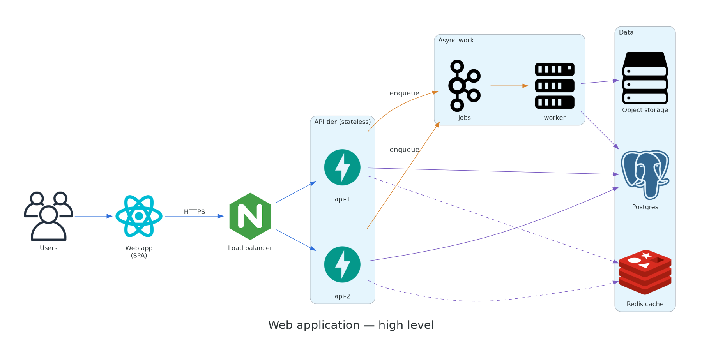

# Web application

A reference layout for a typical web product: a single-page app in front of stateless API servers, with a job queue for slow work. Use it as a starting point for your own high-level design.

## Components

| Component | Responsibility | Scales by |
|---|---|---|
| **Web app (SPA)** | UI, served from a CDN | CDN edge |
| **Load balancer** | TLS termination, routing, health checks | Managed / active-passive |
| **API tier** | Stateless request handling, auth, validation | Horizontal (CPU / RPS) |
| **Jobs queue** | Buffers slow or retryable work | Partitions |
| **Worker** | Emails, exports, image processing | Queue depth |
| **Postgres** | System of record | Vertical + read replicas |
| **Redis** | Cache and rate-limit counters | Memory |
| **Object storage** | Uploads and generated files | Unlimited |

## Request flow

1. The browser loads the SPA and calls the API over HTTPS through the load balancer.
2. An API server checks Redis for a cached answer, otherwise reads from Postgres.
3. Anything slower than about 200 ms goes onto the jobs queue, and the API returns `202 Accepted`.
4. A worker picks up the job, writes results to Postgres or object storage, and the client polls or gets a push notification.

## Key decisions

Why a queue instead of doing the work in the request?

Slow work inside a request ties up API capacity and fails badly under load. A queue absorbs spikes, retries failures, and lets workers scale independently of the API.

Why stateless API servers?

Session state lives in Redis or signed tokens, so any server can handle any request. Scaling out is just adding instances, and a crashed server loses nothing.

