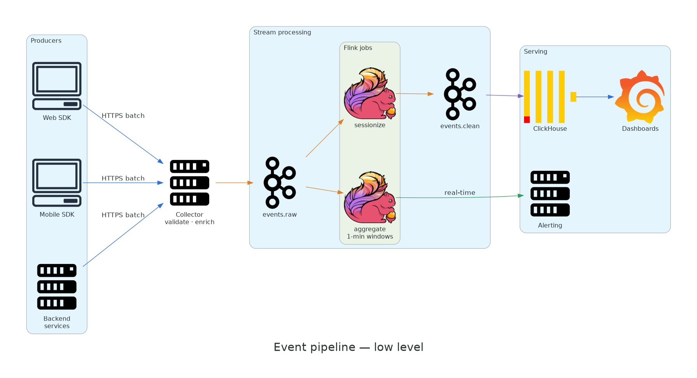

# Event pipeline

A low-level design for collecting product analytics events and serving them both in real time and for historical queries. It shows nested clusters and all four edge colours.



## Stages

1. **Collect.** SDKs batch events and send them over HTTPS. The collector validates each event against its schema, adds server-side fields (received time, geo), and writes to `events.raw`.
2. **Process.** Two Flink jobs read `events.raw`:
    - `sessionize` groups events into user sessions and writes them to `events.clean`;
    - `aggregate` computes 1-minute windows and feeds alerting directly.
3. **Serve.** `events.clean` is loaded into ClickHouse for ad-hoc queries and dashboards.

## Event schema

```json
{
  "event_id": "01J9ZK...",
  "name": "checkout_completed",
  "user_id": "u_123",
  "ts": "2026-01-15T10:00:00Z",
  "props": {"amount": 42.5, "currency": "EUR"}
}
```

## Guarantees

| Property | Approach |
|---|---|
| Delivery | At-least-once end to end; `event_id` deduplicates in ClickHouse |
| Ordering | Per `user_id` (Kafka partition key) |
| Late events | Accepted up to 24 h; windows are re-emitted |
| Latency | Alerts < 5 s; dashboards < 1 min |

!!! note "Adapting this example"
    Swap Flink for Spark Structured Streaming or Kafka Streams, or ClickHouse for BigQuery or Snowflake. Change the imports in `architecture/example_event_pipeline.py` and the diagram updates on save.
